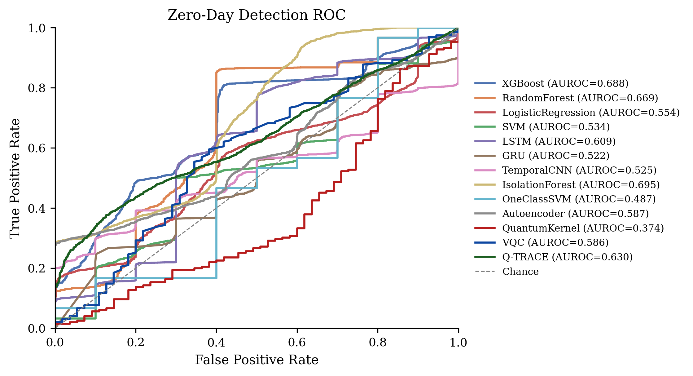
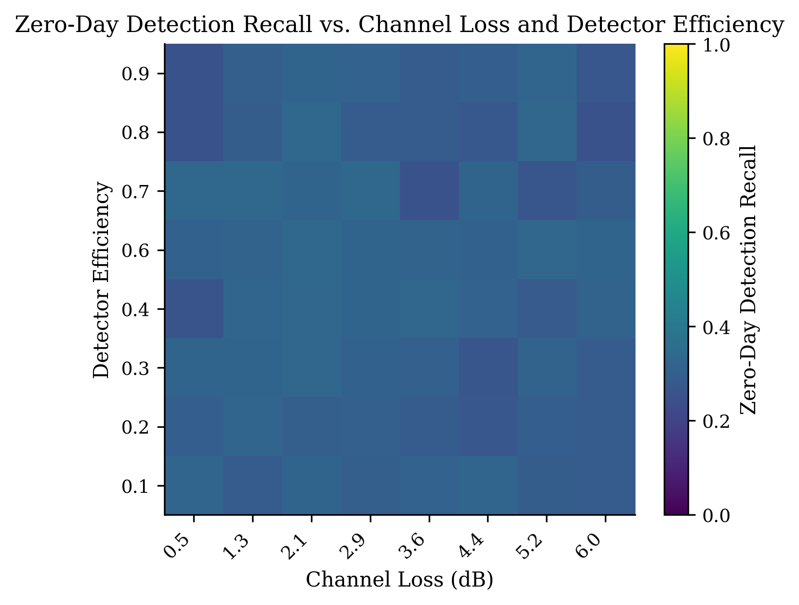
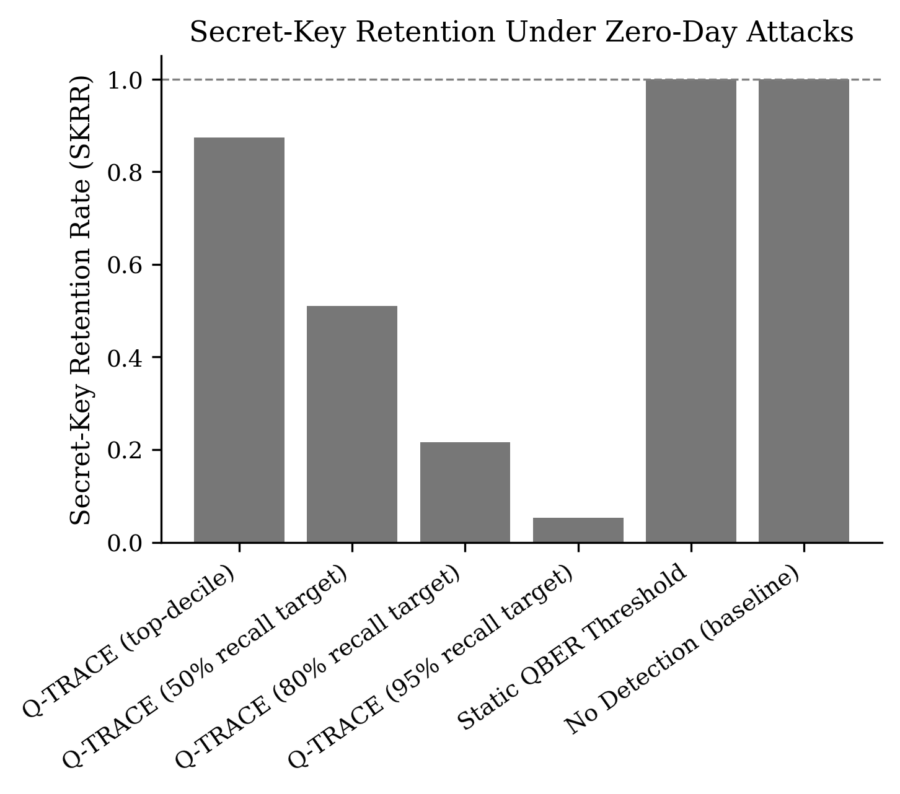
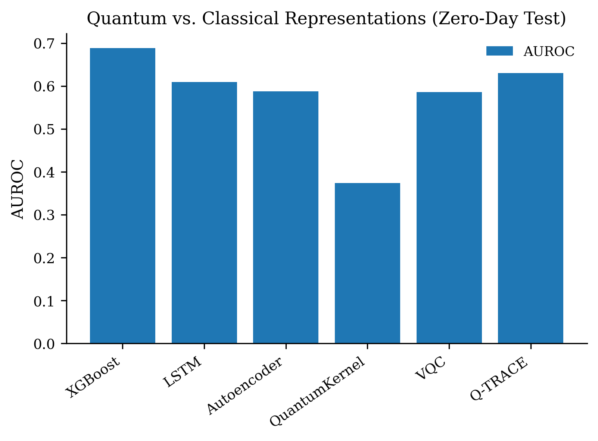

# Q-TRACE

[](https://github.com/YOUR_USERNAME/Q-TRACE/actions/workflows/ci.yml)
[](LICENSE)
[](pyproject.toml)
[](https://www.ibm.com/quantum/qiskit)

**Learning the Quantum Channel: Physics-Informed Quantum Machine Learning for Zero-Day Threat Detection in Practical QKD**

Q-TRACE is a research framework and open benchmark for detecting *previously
unseen* implementation-level attacks on decoy-state BB84 QKD systems. Instead
of training a classifier to recognize known attack signatures, Q-TRACE learns
the physically-constrained manifold of *healthy* QKD operation and flags
statistically and physically inconsistent deviations — evaluated not just by
classification accuracy, but by how much usable secret key is preserved.

> **Status of this repository.** Complete, executable, and independently
> verified end-to-end: a physics-grounded QKD digital twin, six attack
> models, a reproducible benchmark dataset generator, ten classical/anomaly
> baselines, two quantum models (fidelity quantum kernel + VQC), a composite
> Q-TRACE detector with ablation support, real-hardware validation on IBM
> `ibm_marrakesh`, and a 5-seed statistical-significance sweep. `results/`
> and `results_multiseed/` in this repository are the **actual reported
> results** referenced by the accompanying manuscript (see `docs/`), not
> placeholder smoke-test output. Every experiment script also supports a
> `--smoke` flag for a fast correctness check — CI runs these on every push
> (see the badge above) — but `--smoke` output must never be reported as a
> result; see `CHANGELOG.md` for two documented cases where code that ran
> without crashing initially produced methodologically invalid numbers.

## Key results at a glance

| | |
|---|---|
| **Zero-day detection AUROC** | **0.669 ± 0.051** (best mean, low variance, 5 seeds) — see `docs/manuscript-tables.md` Table 1 |
| **Secret-Key Retention @ 80% attack recall** | 27.8% ± 6.9% — full tradeoff curve in Table 4 |
| **Real hardware validation** | Fidelity quantum kernel + VQC executed on `ibm_marrakesh` (156-qubit Heron r2) |
| **Ablation** | Temporal representation: consistently helps (5/5 seeds). Quantum kernel: no measurable zero-day benefit (honest null result, 4/5 seeds) |

<p align="center">
  
  
</p>
<p align="center">
  
  
</p>

Full manuscript-ready tables (LaTeX + Markdown), figure captions, and a
complete Discussion/Limitations writeup are in [`docs/`](docs/).

---

## 1. Repository structure

```
Q-TRACE/
├── .github/
│   ├── workflows/ci.yml          # lint + smoke-test on every push/PR
│   ├── ISSUE_TEMPLATE/           # bug report / feature request templates
│   └── PULL_REQUEST_TEMPLATE.md
├── docs/
│   ├── manuscript-tables.md      # LaTeX + Markdown tables, ready to paste into the paper
│   └── limitations-discussion.md # full Discussion + Limitations sections (manuscript voice)
├── configs/                      # (reserved for experiment config YAMLs)
├── qkd_simulator/                # the QKD Digital Twin
│   ├── config.py                 #   physical parameter ranges (Section 6)
│   ├── physics.py                #   GLLP decoy-state closed-form physics
│   ├── channel.py                #   fiber channel + environmental drift
│   ├── detector.py                #   SPAD/SNSPD model + efficiency drift
│   ├── decoy_state.py            #   Y1/e1 lower/upper bound estimator
│   └── bb84.py                   #   DecoyBB84Simulator: full telemetry generator
├── attacks/                      # pluggable attack modules (Section 9)
│   ├── base.py                   #   Attack interface + CompositeAttack
│   ├── pns.py, intercept_resend.py, trojan_horse.py,
│   │   blinding.py, time_shift.py, rng_manipulation.py
│   └── composite.py              #   registry + canonical compositions (E4)
├── dataset/
│   ├── generate.py               # builds the QKD-TRACE benchmark (Section 25-26)
│   └── */dataset_summary.csv     # small reference summaries (full CSVs are gitignored — see Sec. 4)
├── models/
│   ├── classical_baselines.py    # XGBoost, RandomForest, SVM, LogisticRegression
│   ├── anomaly_baselines.py      # IsolationForest, OneClassSVM, Autoencoder
│   ├── sequence_models.py        # LSTM/GRU/TemporalCNN (torch, with MLP fallback)
│   └── qtrace_detector.py        # the full composite Q-TRACE risk engine
├── quantum/
│   ├── feature_reduction.py      # PCA -> few-qubit angle encoding
│   ├── quantum_kernel.py         # fidelity quantum kernel + SVM (Section 15)
│   ├── vqc.py                    # Variational Quantum Classifier (Section 16)
│   ├── ibm_runtime_job.py        # REAL HARDWARE script for ibm_marrakesh
│   └── decode_hardware_counts.py # decode raw hardware counts -> class probabilities
├── evaluation/
│   ├── data_utils.py             # shared loading / temporal windowing / scaling
│   ├── metrics.py                # AUROC/AUPRC/F1/FAR, SKRR, gating effectiveness, Q-TRACE risk score
│   ├── plotting.py                # Springer/Nature-style figure helpers
│   ├── run_experiments.py        # MASTER script: trains everything, writes tables+figures
│   ├── run_multiseed.py          # 5-seed statistical-significance wrapper (resumable)
│   ├── run_sweep_experiment.py   # channel-loss x detector-efficiency heatmap
│   └── run_adversarial_evasion.py# physically-constrained evasion search
├── notebooks/
│   └── 01_end_to_end_demo.ipynb  # narrated, PRE-EXECUTED walkthrough for Jupyter
├── figures/                      # reported figures (PNG + PDF)
├── results/                      # reported result tables (main run)
├── results_multiseed/            # reported result tables (5-seed aggregate)
├── Makefile                      # `make data`, `make experiments`, `make multiseed`, ...
├── pyproject.toml
├── requirements.txt
├── environment.yml
├── CHANGELOG.md                  # documented fixes, including ones that changed reported numbers
├── CONTRIBUTING.md
├── CODE_OF_CONDUCT.md
├── SECURITY.md                   # credential-handling policy
├── CITATION.cff
└── README.md
```

## 2. Installation

```bash
conda activate qgss                     # your existing environment
pip install -r requirements.txt
```

or, to create the environment from scratch:

```bash
conda env create -f environment.yml
conda activate qgss
```

**Optional — real deep-learning baselines.** If PyTorch is not installed,
`models/sequence_models.py` and `models/anomaly_baselines.py` automatically
fall back to an MLP-based approximation so the pipeline still runs, but this
fallback is NOT equivalent to LSTM/GRU/TemporalCNN/deep-autoencoder and is
logged as such. Install PyTorch separately for genuine sequence-model results:

```bash
pip install torch --index-url https://download.pytorch.org/whl/cpu
```

## 3. Quick start (Jupyter or terminal)

```bash
(qgss) $ jupyter notebook
```
then open `notebooks/01_end_to_end_demo.ipynb`, **or** run everything from
the terminal:

```bash
# Step 1 — generate the benchmark dataset
python -m dataset.generate --out dataset/qkd_trace_v1 \
    --runs-per-class 40 --windows-per-run 120 --block-size 30 --seed 42

# Step 2 — run the full experiment suite (all classical + quantum baselines,
# Q-TRACE composite detector, SKRR, ablation, figures)
python -m evaluation.run_experiments \
    --data dataset/qkd_trace_v1/qkd_trace_telemetry.csv \
    --block-size 30 --n-qubits 6 --out results
```

Outputs:
- `results/comparison_table.csv` — full metrics table across all splits/models (Section 17)
- `results/skrr_table.csv` — Secret-Key Retention Rate comparison (Section 18)
- `results/ablation_table.csv` — Q-TRACE component ablation (Section 38)
- `figures/fig5_roc_zeroday.{png,pdf}`
- `figures/fig7_skrr.{png,pdf}`
- `figures/fig8_quantum_vs_classical.{png,pdf}`

Use `--smoke` on `run_experiments.py` for a fast (~1 minute) correctness
check with tiny subsamples — **never use `--smoke` output for reported
results.**

## 4. Reproducing paper-scale results

The defaults above (`--runs-per-class 40 --windows-per-run 120`) produce a
dataset large enough for meaningful ROC/AUPRC estimates but still fast
(minutes) to generate on a laptop. Three additional experiment scripts
extend the core pipeline to the remaining sections of the research plan
(shortcuts for all of these are also in the `Makefile` — `make sweep`,
`make evasion`, `make multiseed`):

```bash
# Section 22/23 — zero-day recall vs. channel loss x detector efficiency
# (produces the Figure 6 signature heatmap)
python -m evaluation.run_sweep_experiment --n-loss 8 --n-eta 8 \
    --runs-per-point 8 --windows-per-run 80 --out results

# Section 24 — physically-constrained adversarial evasion search
# (black-box evolutionary search over attack strength/onset, since the
# full Q-TRACE pipeline is not end-to-end differentiable)
python -m evaluation.run_adversarial_evasion --attack pns \
    --n-iterations 60 --population 16 --out results
# repeat for each attack family you want an evasion-gap estimate for
```

Both scripts also accept `--smoke` for a fast correctness check.

### Multi-seed runs (error bars for your comparison table)

A single seed's AUROC is a point estimate — a Q1 reviewer will ask for
variance across independent draws. `evaluation/run_multiseed.py` repeats
the **entire** pipeline (fresh dataset generation AND model training) across
N seeds and aggregates each `(split, model, metric)` cell into mean +/- std:

```bash
python -m evaluation.run_multiseed --seeds 42 43 44 45 46 \
    --runs-per-class 40 --windows-per-run 120 --block-size 30 \
    --n-qubits 6 --out results_multiseed
```

This is expensive (it reruns dataset generation + the full experiment suite
once per seed), so it supports **resuming**: if a seed's output already
exists in `--out`, it is skipped automatically. Re-running the same command
after an interruption (laptop sleep, closed terminal, etc.) picks up where
it left off. Use `--force` to redo already-completed seeds anyway.

Outputs:
- `results_multiseed/comparison_table_mean_std.csv` — mean +/- std per split/model, the table you actually cite
- `results_multiseed/comparison_table_all_seeds_raw.csv` — every individual seed's raw numbers, for full transparency/appendix
- `figures/fig5b_zeroday_auroc_error_bars.{png,pdf}` — zero-day AUROC with error bars across seeds

Use `--smoke` first (a couple of minutes) to confirm the whole multi-seed
loop works on your machine before committing to a several-hour full run.

### What's committed to this repository vs. regenerated locally

`results/`, `results_multiseed/`, and `figures/` contain the **actual
reported results** referenced by the manuscript (`docs/manuscript-tables.md`)
and are version-controlled — small CSVs and a handful of figures, a few MB
total. `dataset/*/qkd_trace_telemetry.csv` and `*.npz` are **not**
committed (see `.gitignore`): each is 15–20 MB per seed and, critically,
100% deterministically reproducible from the `--seed` argument recorded
alongside every generator invocation, so committing them would only bloat
git history without adding reproducibility. The tiny `dataset_summary.csv`
per seed *is* kept as a lightweight, diffable record of what was generated.
Regenerate any dataset with the exact command in Section 3/this section —
the seed is the only input that matters.

## 5. Running on real IBM Quantum hardware (`ibm_marrakesh`)

`quantum/ibm_runtime_job.py` is the real-hardware execution script.
**This repository's reported results include genuine execution on real
`ibm_marrakesh` hardware** (156-qubit Heron r2) — both an 8×8 fidelity
quantum kernel Gram matrix and 16 VQC inference circuits, each completing
in well under a minute of wall-clock time and comfortably inside an
8-minute QPU budget. Before running on your own hardware allocation,
validate the exact code path offline against a fake backend first:

```bash
python -m quantum.ibm_runtime_job --mode kernel --n-qubits 4 \
    --n-train 6 --n-test 6 --shots 256 --use-fake-backend \
    --out results/test_kernel_fake.npy
```

Then, in a notebook cell or Python shell (this is the exact credential
pattern used to obtain this repository's reported hardware results —
paste your own credentials at runtime only, never into a committed file):

```python
import warnings
warnings.filterwarnings("ignore")
from qiskit_ibm_runtime import QiskitRuntimeService

# Paste your credentials here (only need to do this once)
QiskitRuntimeService.save_account(
    token="my_api_key",
    instance="my_crn",
    overwrite=True,
    set_as_default=True,
)

# Verify
service = QiskitRuntimeService()
backends = service.backends()
print(f"Account OK. {len(backends)} backend(s) available:")
for b in backends[:5]:
    print(f"  {b.name} ({b.num_qubits} qubits)")
```

Then run against real hardware from the terminal:

```bash
# Fidelity quantum kernel on real hardware
python -m quantum.ibm_runtime_job --mode kernel --n-qubits 4 \
    --n-train 8 --n-test 8 --shots 512 --backend ibm_marrakesh \
    --max-qpu-seconds 420 --out results/kernel_ibm_marrakesh.npy

# VQC inference on real hardware (train on simulator first, no QPU cost):
python -c "
import numpy as np
from evaluation.data_utils import load_telemetry, make_windows
from quantum.feature_reduction import QuantumFeatureReducer
from quantum.vqc import fit_vqc
from models.classical_baselines import flatten

df = load_telemetry('dataset/qkd_trace_v1/qkd_trace_telemetry.csv')
train = df[df.split=='train']
X_train, y_train, meta = make_windows(train, block_size=30)
reducer = QuantumFeatureReducer(n_qubits=6)
Xtr_red = reducer.fit_transform(flatten(X_train))
vqc = fit_vqc(Xtr_red, y_train, n_qubits=6, subsample=250, maxiter=120)
np.save('results/vqc_trained_params.npy', vqc.weights)
"
python -m quantum.ibm_runtime_job --mode vqc_eval --n-qubits 6 \
    --n-test 16 --shots 512 --vqc-params results/vqc_trained_params.npy \
    --backend ibm_marrakesh --max-qpu-seconds 300 \
    --out results/vqc_ibm_marrakesh.npy

# Decode raw hardware measurement counts into class-1 probabilities
python -m quantum.decode_hardware_counts \
    --counts results/vqc_ibm_marrakesh.npy \
    --out results/vqc_ibm_marrakesh_proba.npy
```

**Important — plan/execution-mode note.** IBM's **Open (free) plan does
not permit `Session` mode** (`HTTP 400: You are not authorized to run a
session when using the open plan`). `ibm_runtime_job.py` defaults to
plain **job mode**, which works on every plan tier; pass `--use-session`
only if you are on a paid plan and specifically want session-mode queue
priority. See `CHANGELOG.md` for the fix history on this.

### 8-minute QPU budget

`--max-qpu-seconds` is a **hard pre-flight ceiling**: the script statically
estimates expected QPU execution time from `n_circuits x shots x
per-shot-duration` *before* submitting anything, and aborts with no charge
to your allocation if the estimate exceeds the budget. Default is 420s
(7 minutes), leaving margin under an 8-minute allocation. This is a
conservative *estimate*, not a guarantee from IBM — always cross-check your
account's usage dashboard during/after a real run, and start with small
`--n-train/--n-test/--shots` values and scale up only after confirming actual
consumed time on your account page.

Two modes are provided:
- `--mode kernel` — evaluates a small fidelity-quantum-kernel Gram sub-block
  directly on hardware (a few 4-qubit ZZFeatureMap circuits).
- `--mode vqc_eval` — loads VQC weights **pre-trained on the simulator**
  (`quantum/vqc.py`) and runs inference-only circuits on hardware (no
  on-hardware optimization loop, which would consume the entire budget in a
  handful of iterations).

## 6. Standards alignment

Q-TRACE is positioned as an **implementation-security monitoring framework**,
not a replacement for information-theoretic QKD security proofs. Relevant
standards context: ETSI QKD Industry Specification Group work on
implementation security, optical characterization and penetration testing;
ISO/IEC 23837-1:2023 (security evaluation of QKD modules); ITU-T X.1713
(security requirements for QKD nodes) and X.1717 (QKD network control/
management security).

## 6.5 Known-issue changelog

See [`CHANGELOG.md`](CHANGELOG.md) for the full, dated list of fixes —
including two that changed previously-reported numbers (the physics-
consistency term and the VQC evaluation subsample) and are worth reading
before citing any number from an older checkout of this repository.

## 7. Citation

If you use the QKD-TRACE benchmark or Q-TRACE detector in your research,
please cite the accompanying paper (add your citation / CITATION.cff once
published) and reference this repository. Manuscript-ready tables and a
full Discussion/Limitations writeup are in [`docs/`](docs/).

## 8. License

See `LICENSE` (MIT). The QKD-TRACE dataset generator produces **synthetic**
telemetry only — no real QKD hardware or proprietary data is used or
required.

## 9. Contributing

Contributions are welcome — see [`CONTRIBUTING.md`](CONTRIBUTING.md) for
development setup, testing requirements, and PR guidelines, and
[`CODE_OF_CONDUCT.md`](CODE_OF_CONDUCT.md) for community standards. Please
review [`SECURITY.md`](SECURITY.md) before working with the IBM Quantum
hardware scripts.
